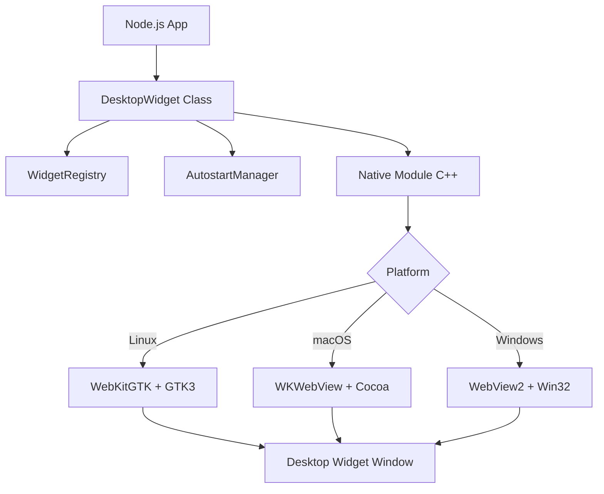

# WidgetCore 🚀

**WidgetCore** is a high-performance, cross-platform library built with Node.js and C++ for creating interactive and persistent desktop widgets. It leverages native OS webview engines (**WebView2** on Windows, **WKWebView** on macOS, and **WebKitGTK** on Linux) to provide a seamless, lightweight, and hardware-accelerated widget experience.

---

## 🏗️ Architecture Overview

WidgetCore uses a hybrid architecture where the core logic is managed in Node.js, while windowing and webview rendering are handled by a native C++ module (`widget_core.node`).



---

## ✨ Core Capabilities

- **🚀 HTML/JS Power**: Build widgets using any web technology. No restricted environments.
- **🖼️ Native Transparency**: Aggressive transparency settings ensure widgets blend perfectly with wallpapers.
- **🖇️ System Integration**: Widgets are pinned below icons (on supported platforms) and removed from taskbars/app-switchers.
- **🖱️ Full Interactivity**: Toggle `interactive: true` to allow mouse clicks and keyboard input directly on the desktop background.
- **💾 Auto-Persistence**: Automatically saves widget state and ensures they reappear after system reboots.
- **🧩 Scroll-Free Design**: Scrollbars are hidden by default via CSS injection, with optional overflow prevention.

---

## 🔒 Security Shield

Security is a primary concern for widgets. **WidgetCore** implements a multi-layer "Shield" to protect the host system:

1. **API Isolation**: Injects a preload script that freezes `process`, `require`, and other sensitive Node.js globals.
2. **Context Separation**: The webview runs in a sandboxed environment where it cannot access the local filesystem or execute shell commands directly.
3. **Protocol Filtering**: Only `http:`, `https:`, and valid `file:` protocols are allowed for loading content.
4. **Keyword Blocking**: Input data and URLs are scanned for dangerous keywords like `shell`, `eval`, or `exec`.

---

## 🚀 Detailed Usage

### Advanced HTML Widget Example
You can create complex, self-contained widgets using a single string:

```typescript
import { DesktopWidget } from 'widget-core-windows';

const clockHTML = `
  <div id="clock" style="font-size: 48px; font-weight: bold; color: #60A5FA; font-family: sans-serif; text-shadow: 2px 2px 10px rgba(0,0,0,0.5);">00:00:00</div>
  <script>
    setInterval(() => {
      document.getElementById('clock').innerText = new Date().toLocaleTimeString();
    }, 1000);
  </script>
`;

const widget = new DesktopWidget("", {
  html: clockHTML,
  width: 300,
  height: 100,
  x: 50,
  y: 50,
  scroll: false,
  interactive: false // Clocks usually don't need input
});

// Make it stay after reboot
await widget.makePersistent(widget.options);
```

### Static Global Management
```typescript
// Stop all running widgets across the system
const stopped = DesktopWidget.stopAll();

// Get list of all registered widgets
const widgets = DesktopWidget.listWidgets();
widgets.forEach(w => console.log(`ID: ${w.id}, URL: ${w.url}, Active: ${w.active}`));
```

---

## 🛠️ API Documentation

### `WidgetOptions`
| Property | Type | Description |
| :--- | :--- | :--- |
| `width` | `number` | Width in pixels. |
| `height` | `number` | Height in pixels. |
| `x` | `number` | X coordinate from top-left. |
| `y` | `number` | Y coordinate from top-left. |
| `opacity` | `number` | Window opacity (0.0 to 1.0). Default: `1.0`. |
| `interactive` | `boolean` | If `true`, clicks pass through to the widget. Default: `false`. |
| `html` | `string` | Raw HTML/CSS source code to load. |
| `scroll` | `boolean` | If `false`, `overflow: hidden` is applied. Default: `true`. |
| `blur` | `boolean` | Platform-specific background blur effect. |

### Instance Methods
- **`makePersistent(options): Promise<boolean>`**: Saves to disk and enables autostart.
- **`activate(): boolean`**: Enables autostart and launches the process.
- **`deactivate(): boolean`**: Disables autostart and kills the process.
- **`launchStandalone(): boolean`**: Spawns a background `runner.js` process for the widget.

---

## 🐧 Linux Platform Notes (GTK/WebKit)
On Linux, WidgetCore uses GTK and WebKitGTK. For full transparency, ensure your window manager/compositor (like Mutter on GNOME or KWin on KDE) is configured correctly.
- **Dependencies**: `libwebkit2gtk-4.0-dev` or `libwebkit2gtk-4.1-dev`.
- **Autostart**: Creates `.desktop` files in `~/.config/autostart/`.

---

## 🍎 macOS Platform Notes (Cocoa/WKWebView)
- **Engine**: WKWebView.
- **Autostart**: Creates `.plist` files in `~/Library/LaunchAgents/`.
- **Transparency**: Fully supported out-of-the-box.

---

## 💻 Windows Platform Notes (Win32/WebView2)
- **Engine**: WebView2 (Evergreen Runtime required).
- **Autostart**: Uses the `HKCU\Software\Microsoft\Windows\CurrentVersion\Run` registry key.

---

## 🧪 Development & Testing

We use **Vitest** for unit testing. The native layer is mocked automatically during tests.

```bash
# Install dependencies
npm install

# Build native module & TypeScript
npm run build

# Run tests
npm test
```

---

## 🐛 Troubleshooting

- **Widget background is white on Linux**: Ensure your compositor supports transparency. We use ARGB visual for the GTK window.
- **Keyboard input not working**: Set `interactive: true` in the options.
- **Widget doesn't appear after restart**: Check if the registry file `~/.config/widget-core-windows/widgets.json` exists and the autostart entry is correct.

---

## 📝 License
MIT License. Copyright (c) 2026 Osman Beyhan. Contributions are welcome!
