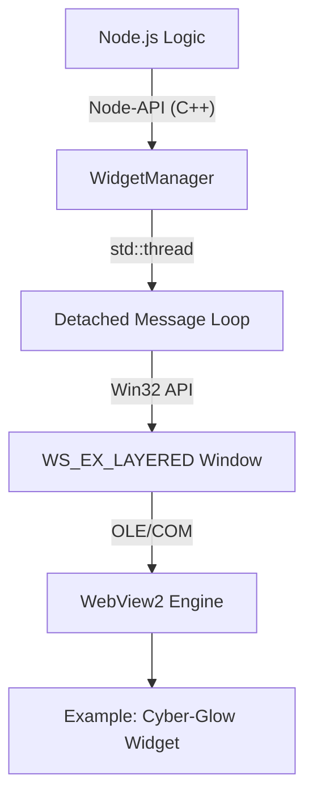

# WidgetCore 🚀 (Windows Optimized)

**WidgetCore** is a high-performance, Windows-optimized library built with Node.js and C++ for creating interactive and persistent desktop widgets. By leveraging the native **Win32 API** and **WebView2**, WidgetCore provides a lightweight, hardware-accelerated experience that feels like a natural part of the Windows desktop.

---

## 🏗️ Architecture: The Node-Native Bridge

WidgetCore uses a sophisticated hybrid architecture to combine the rapid development of web technologies with the power of native system APIs.

### 1. The Win32 Message Loop
Unlike standard Node.js applications that run on a single thread, WidgetCore spawns a **dedicated, detached Win32 thread** for each widget. This ensures that:
-   The Node.js event loop remains unblocked.
-   Window messages (resizing, clicking, painting) are handled with sub-millisecond latency.
-   The widget remains responsive even if the main Node.js process is busy with heavy computations.

### 2. OLE/COM Browser Hosting
WidgetCore embeds the **Microsoft WebView2** engine (Edge/Chromium) using the `IWebBrowser2` interface (via OLE). This provides:
-   Full HTML5/CSS3/ES6 support.
-   Hardware-accelerated rendering.
-   Low memory footprint compared to full Electron shells.



---

## ✨ The "Cyber-Glow" Mode (Native Features)

WidgetCore is designed for high-end desktop aesthetics. It implements several advanced Win32 techniques:

### 🖼️ Aggressive Transparency
Using `WS_EX_LAYERED` and `LWA_COLORKEY`, WidgetCore achieves true transparency. The native layer uses a specific color key (`RGB(1, 1, 1)`) as the transparency mask, allowing for:
-   Non-rectangular widget shapes.
-   Anti-aliased "glow" effects that blend into the wallpaper.
-   No ugly borders or standard window decorations.

### 🌌 DWM Blur Behind
By interfacing with `dwmapi.dll`, WidgetCore can enable the **Aero Glass / Acrylic** effect behind your widget.
-   **Config**: Set `blur: true` in `WidgetOptions`.
-   **Effect**: The background of your widget will have a beautiful, frosted-glass blur that interacts with the wallpaper.

### 🖱️ Click-Through Interactivity
You can control how the widget interacts with the mouse:
-   **Interactive (`true`)**: The widget behaves like a normal window (receives clicks).
-   **Click-Through (`false`)**: Mouse events pass directly through the widget to the desktop icons or other windows behind it.

---

## 🔒 Security Shield Architecture

Security is baked into the core. Every widget is wrapped in a multi-stage **Security Shield**:

1.  **Context Isolation**: Injected CSS and JS freeze the environment. Standard Node.js entry points (`process`, `require`) are purged before the widget content loads.
2.  **Protocol Filtering**: Only `http:`, `https:`, and strictly validated `file:///` protocols are permitted. This prevent `javascript:` or `data:` URL exploits.
3.  **Keyword Scanning**: All input triggers (URLs and HTML blobs) are scanned for high-risk system keywords (`shell`, `exec`, `eval`, `process`).

---

## 💾 Persistence & Standalone Execution

WidgetCore widgets can survive system reboots and process crashes.

### 1. The Registry Lifecycle
The `AutostartManager` interfaces with the Windows Registry:
`HKCU\Software\Microsoft\Windows\CurrentVersion\Run`
It creates a unique entry for each persistent widget that triggers a `runner.js` script on login.

### 2. Standalone Runner
The `runner.js` is a lightweight entry point that reconstructs a widget instance from the `widgets.json` registry file without requiring the primary application to be running.

---

## 🚀 Getting Started

### Installation
```bash
npm install @osmn-byhn/widget-core-windows
```
*Note: Requires Visual Studio Build Tools and Node-GYP for native compilation.*

### Basic Usage
```typescript
import { DesktopWidget } from '@osmn-byhn/widget-core-windows';

const widget = new DesktopWidget("https://my-widget-dashboard.com", {
  width: 350,
  height: 500,
  x: 100,
  y: 100,
  opacity: 0.9,
  blur: true,      // Glass effect
  sticky: true     // Stays on bottom
});
```

---

## 🛠️ API Reference

### `WidgetOptions`
| Property | Type | Default | Description |
| :--- | :--- | :--- | :--- |
| `width` / `height` | `number` | `400` | Dimensions in pixels. |
| `x` / `y` | `number` | `100` | Screen coordinates (0,0 is top-left). |
| `opacity` | `number` | `1.0` | Global alpha (0.0 - 1.0). |
| `blur` | `boolean` | `false` | Enables DWM Blur Behind (Acrylic look). |
| `sticky` | `boolean` | `true` | Pins the widget to the bottom layer (desktop). |
| `interactive` | `boolean` | `true` | Set to `false` for click-through mode. |
| `html` | `string` | `""` | Direct HTML string if no URL is provided. |

### `DesktopWidget` Methods
-   `setPosition(x, y)`: Real-time window movement.
-   `setOpacity(value)`: Smooth alpha transitions.
-   `makePersistent(options)`: Registers the widget for autostart.
-   `static stopAll()`: Kills all running widget processes across the system.

---

## 📝 License
MIT License. Copyright (c) 2026 Osman Beyhan.
